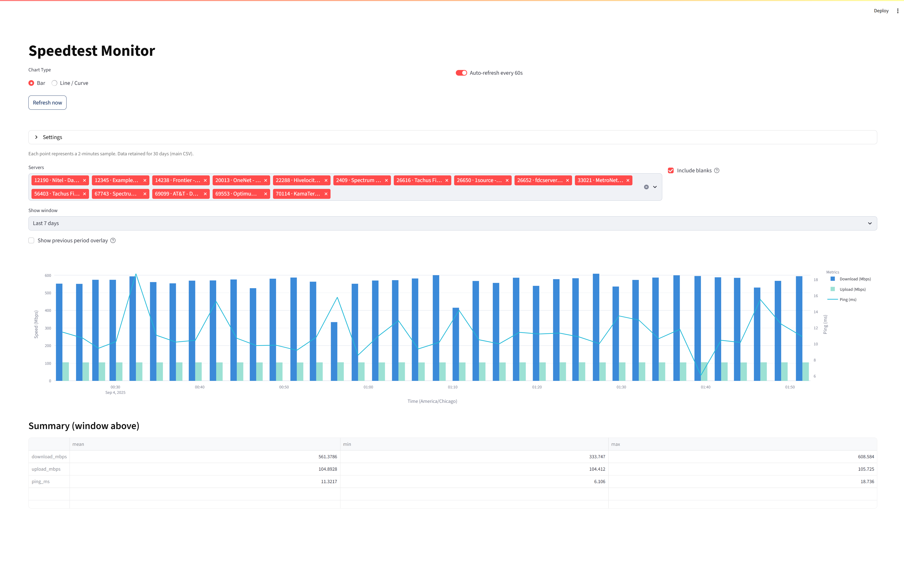

# Speedtest Dashboard  

  
  
  
  

A self-hosted internet speed monitoring tool.  
It collects ping, download, and upload speeds periodically using **Ookla’s Speedtest CLI** (preferred) or the **Python speedtest-cli library** (fallback).  
Data is stored in CSV format and visualized via a Streamlit dashboard.

---

## ✨ Features
- Collects results at a configurable interval (default: 2 minutes).
- Stores 30 days of results in the main CSV, plus up to 12 months of monthly archives.
- Streamlit dashboard with:
  - Bar / Line chart toggle
  - Timezone selector
  - Auto or manual refresh
  - Historical overlays (hourly, daily, weekly, monthly, yearly)
  - Custom color selection (download, upload, ping)
  - Light/Dark/Auto theme
- Multi-server support (test one or more Speedtest servers).
- Automation launchers: PowerShell (`RunSpeedTest.ps1`) and Batch (`RunSpeedTest.bat`).

---

## 📸 Preview
Here’s what the dashboard looks like in action:



---

## 📂 Repository Structure
```
speedtest-dashboard/
│── collector.py         # Collector script (runs speed tests and stores results)
│── dashboard.py         # Streamlit dashboard UI
│── requirements.txt     # Python dependencies
│── RunSpeedTest.ps1     # PowerShell launcher (preferred)
│── RunSpeedTest.bat     # Batch launcher (legacy/simple)
│── setup_venv.bat       # Creates local virtualenv + installs dependencies
│── Tools/               # Helper scripts (ignored in repo)
│── docs/wiki/           # Project Wiki (markdown files)
│── .gitignore
│── LICENSE
│── README.md
```

---

## ⚡ Quick Start (Windows)

1. **Clone this repository**:
   ```powershell
   git clone https://github.com/RamrattanN/speedtest-dashboard.git
   cd speedtest-dashboard
   ```

2. **Set up dependencies** (one-time):
   ```powershell
   setup_venv.bat
   ```

3. **Run the system**:

   **Preferred (PowerShell):**
   ```powershell
   .\RunSpeedTest.ps1 -Interval 120 -Port 8501
   ```
   - Two windows will open:
     - **Collector** (runs tests every 2 minutes by default)
     - **Dashboard** (Streamlit web UI at [http://localhost:8501](http://localhost:8501))

   **Legacy (Batch):**
   ```powershell
   .\RunSpeedTest.bat
   ```

---

## ⚙️ Configuration

- **Collector interval**: `-Interval` parameter in `RunSpeedTest.ps1` (or edit `.bat`).  
- **Dashboard port**: `-Port` parameter in `RunSpeedTest.ps1`.  
- **Headless mode**: `.\RunSpeedTest.ps1 -Headless` (no browser auto-open).  
- **Python executable**: `-Python` parameter in `RunSpeedTest.ps1`.  
- **Theme**: switch between Light / Dark / Auto in the dashboard UI.  
- **Timezone**: select your local timezone in the dashboard UI.  
- **Colors** (default):
  - Upload: `#8BDCCD`
  - Download: `#1976D2`
  - Ping: `#20B9D8`

---

## 📊 Example
Each point on the chart represents one sample.  
The dashboard can overlay previous periods (e.g., last 24h vs. previous 24h).

---

## 📚 Documentation

Full usage guides and advanced topics are available in the [Wiki](docs/wiki/SUMMARY.md):

- [Getting Started](docs/wiki/Getting-Started.md)
- [Configuration](docs/wiki/Configuration.md)
- [Running the Dashboard](docs/wiki/Running-the-Dashboard.md)
- [Customization](docs/wiki/Customization.md)
- [Troubleshooting](docs/wiki/Troubleshooting.md)
- [Roadmap](docs/wiki/Roadmap.md)
- [Credits](docs/wiki/Credits.md)

---

## 🔧 Requirements
- Windows 10/11  
- Python 3.11+  
- [Ookla Speedtest CLI](https://www.speedtest.net/apps/cli) (recommended)  
- Streamlit + Python dependencies (installed via `requirements.txt`)

---

## 📝 License
This project is licensed under the **MIT License** – see the [LICENSE](LICENSE) file for details.  
It respects Ookla’s license: you may not use Speedtest data commercially.  

---

## 🙌 Credits

- **Concept & Direction**: [Nilesh Ramrattan](https://github.com/RamrattanN)  
  Provided the overall vision, requirements, and design guidance for building a reliable, self-hosted speedtest monitoring dashboard.

- **Development**: Assisted by ChatGPT (OpenAI)  
  Supported with Python, Streamlit, and automation code generation, along with setup scripts and documentation.

- **Technologies**:
  - [Ookla Speedtest CLI](https://www.speedtest.net/apps/cli) – backbone for accurate speed measurements.
  - [Streamlit](https://streamlit.io) – dashboard UI framework.
  - [pandas](https://pandas.pydata.org) & [numpy](https://numpy.org) – data processing.
  - [plotly](https://plotly.com/python/) – interactive charting.

---
